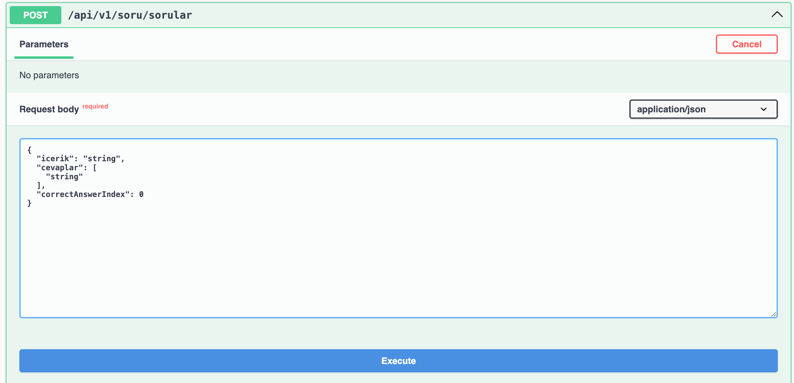

"cevaplar":[
"Cevap 1",
"Cevap 2"
]

"cevaplar":[
    "Cevap 1",
    "Cevap 2",
    "Cevap 3",
    "Cevap 4"
]

Şeklinde istenilen kadar şık eklenebilir.
Doğru cevabı belirlemek için dizideki elemanın index numarası yazılması gerek.